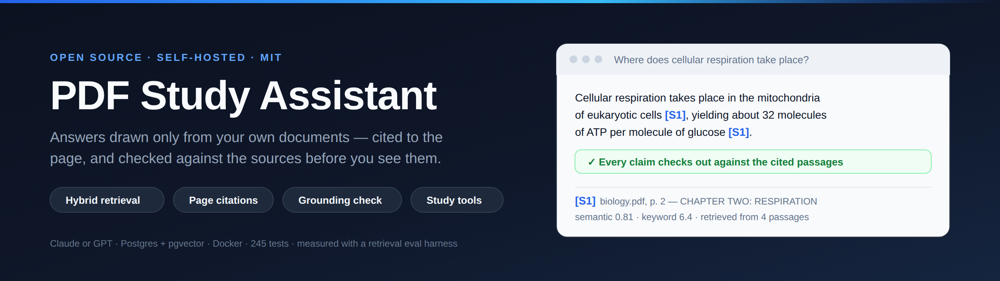
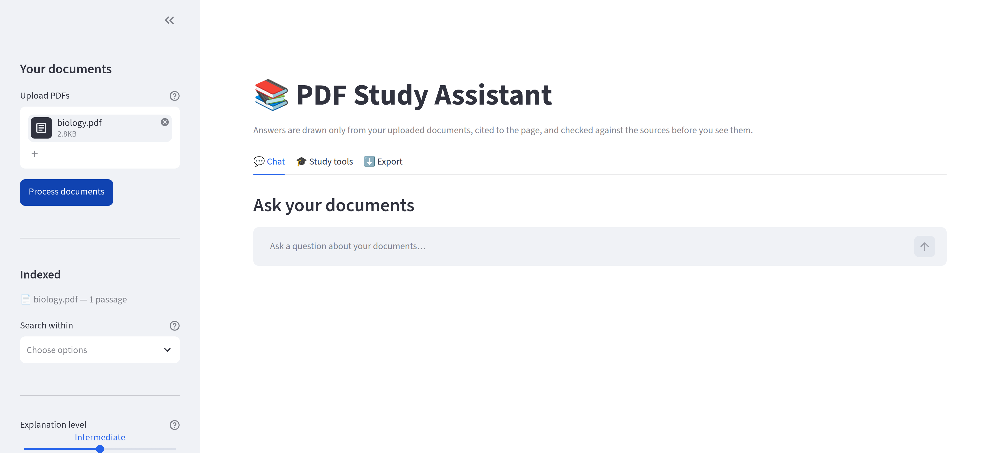
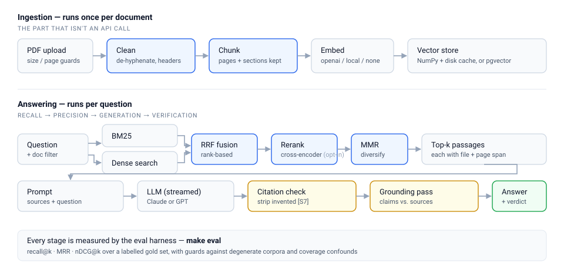
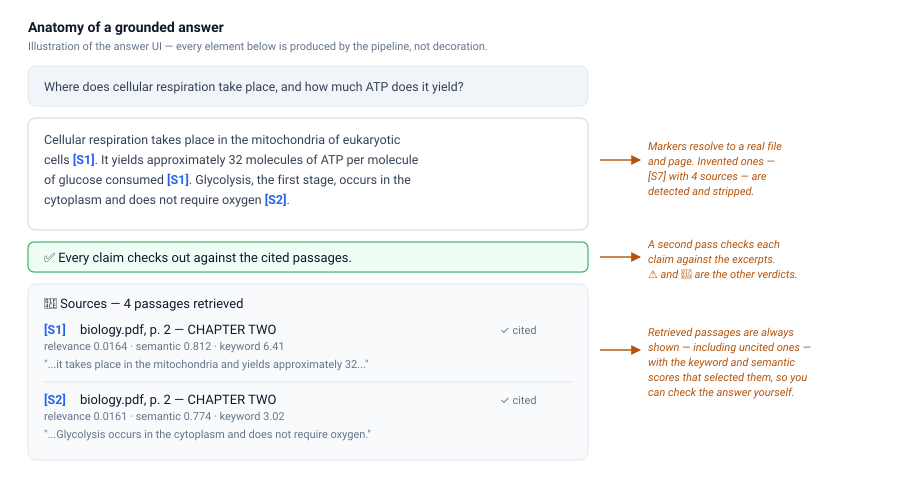
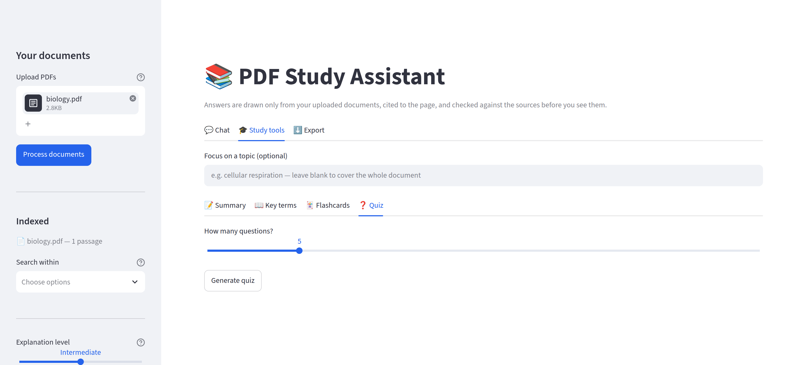

<div align="center">



# 📚 PDF Study Assistant

**A self-hosted study assistant that answers only from your own PDFs, cites every claim to the page, and checks itself before you see the answer.**

[](https://github.com/lewisjohnvillamor/pdf_chatbot/actions/workflows/ci.yml)
[](https://www.python.org/downloads/)
[](LICENSE)
[](tests/)
[](https://buymeacoffee.com/lewisjohnvil)

</div>



---

## What makes it different

Most "chat with your PDF" projects concatenate `extract_text()` output, split it
every 1000 characters, and hand the result to an LLM. That fails in specific,
predictable ways. This project addresses each one — and **ships an evaluation
harness so you can check whether it actually worked.**

| Problem with the naive approach | What this does instead |
| --- | --- |
| Hyphenated words split across lines (`informa-\ntion`) become junk tokens | De-hyphenation and soft-wrap repair rejoin them |
| Running headers and page numbers repeat in every chunk | Cross-page repetition analysis strips furniture, protecting body text |
| Fixed-size splits cut sentences in half and lose the page number | Structure-aware chunking packs whole paragraphs and records the page span |
| Repeated boilerplate is embedded once per page | SimHash near-duplicate collapsing removes it before embedding |
| Vector search misses exact terms (`Article 7(b)`, `NADPH`) | Hybrid BM25 + dense retrieval, fused with Reciprocal Rank Fusion |
| Top-k returns six near-copies of one paragraph | Maximal Marginal Relevance diversifies the context |
| The model cites a page that doesn't support the claim | A verification pass checks each claim against the excerpts |
| The model invents `[S7]` when only 5 sources exist | Fabricated citation markers are detected and stripped |
| Re-uploading the same PDF re-pays the embedding bill | Content-hash fingerprinting caches the built index |
| The corpus dies with the process | Optional Postgres + pgvector, shared across replicas |
| **Nobody knows whether any of it helps** | **A labelled gold set and retrieval metrics — [see below](#measuring-retrieval)** |

---

## How it works



Ingestion runs once per document; answering runs per question. The stages in
blue are where the quality comes from — everything else is plumbing around five
API calls.

### What an answer looks like



Three things are always true of an answer:

1. **Every factual claim carries a marker** resolving to a file and page span.
2. **A grounding verdict** (✅ / ⚠️ / 🚩) from a second pass that compares each
   claim against the excerpts it cites.
3. **The retrieved passages are shown** — including the ones the model *didn't*
   cite — with the keyword and semantic scores that selected them.

When the documents don't contain the answer, it says so and stops:

> The documents don't cover this. Nothing in the uploaded material matched your
> question closely enough to answer it.

---

## Quick start

### Local (5 minutes)

```bash
git clone https://github.com/lewisjohnvillamor/pdf_chatbot
cd pdf_chatbot

python -m venv .venv && source .venv/bin/activate
pip install -r requirements.txt

cp .env.example .env          # add ANTHROPIC_API_KEY or OPENAI_API_KEY
python -m pdfchat.cli check-config   # validate before starting
streamlit run app.py          # → http://localhost:8501
```

### Self-hosted with Docker (recommended)

```bash
cp .env.example .env

python -m pdfchat.cli hash-password              # → APP_PASSWORD_HASH=... for .env
echo "POSTGRES_PASSWORD=$(openssl rand -base64 24)" >> .env

# In .env: set your API key and VECTOR_STORE=postgres
docker compose up -d --build
```

Brings up the app plus `pgvector/pgvector:pg16`. There is no default database
password — compose refuses to start without `POSTGRES_PASSWORD`, rather than
running with one published in this repository. The database port is **not**
published — only the app reaches it over the internal network. Chunks,
embeddings and conversations persist in named volumes across restarts.

### No API key at all

```bash
# .env
EMBEDDING_PROVIDER=none    # keyword-only retrieval, zero embedding cost
```

Retrieval runs on BM25 alone. Recall on paraphrased questions drops, but
citations, grounding and study tools work identically. You still need a chat
provider for generation.

---

## Using it



### 1. Upload

Drop PDFs into the sidebar and press **Process documents**. The app reports how
many pages and passages it indexed.

Scanned PDFs are **rejected**, not silently returned empty:

```
biology.pdf has no extractable text — it is most likely a scanned document.
Run OCR on it (for example `ocrmypdf in.pdf out.pdf`) and upload the result.
```

Re-uploading the same file is free — it restores from cache instead of
re-embedding.

### 2. Ask

Type a question. The answer streams in with `[S1]`-style markers. Expand
**📎 Sources** to see every retrieved passage, whether it was cited, and why it
was selected.

Useful controls:

| Control | What it does |
| --- | --- |
| **Explanation level** | Beginner defines every term; Expert assumes the field |
| **Search within** | Restrict retrieval to specific documents |
| **Session cost & config** | Live token and USD totals, cache hits, and the active configuration |

### 3. Study

The **🎓 Study tools** tab generates material from the same retrieved passages:

- **Summary** — cited, structured, at your chosen level
- **Key terms** — a glossary defined from the documents
- **Flashcards** — exportable as Anki-ready TSV
- **Quiz** — multiple choice, scored, with explanations and sources

Optionally focus them on a topic; leave blank to cover the whole document.

### 4. Export

The **⬇️ Export** tab downloads the full transcript as Markdown — questions,
answers, citations and grounding verdicts.

---

## Measuring retrieval

Generation quality is downstream of retrieval: if the passage containing the
answer never reaches the prompt, no model and no prompt can recover it.

```bash
make eval        # offline, no API cost — runs in CI
make eval-real   # uses your configured embedding provider
```

The harness pushes real PDFs through the **whole production path** — ingest,
clean, chunk, embed, index — and scores 22 labelled questions plus a negative
control.

### A finding this harness produced

MMR was computing its relevance term from raw embedding similarity, discarding
the fusion scores upstream of it. Fixing that (`retrieval.py`, MMR now accepts
an upstream relevance vector):

| | recall@5 | MRR | misses |
| --- | --- | --- | --- |
| Before | 0.864 | 0.841 | 3 |
| After | **1.000** | **0.933** | **0** |

That bug was invisible without measurement. It is the reason this harness
exists.

### A second finding

The README claimed hybrid retrieval catches exact terms like `Article 7(b)`.
It did not. The word tokenizer split `Article 7(c)` into `article`, `7` and
`c`; the last two are single characters and were discarded, so **7(a), 7(b)
and 7(c) all reduced to `article`** and were indistinguishable to keyword
search. Structured identifiers are now emitted whole, alongside the ordinary
words:

| | recall@1 | MRR@5 | nDCG@5 |
| --- | --- | --- | --- |
| Before | 0.909 | 0.933 | 0.927 |
| After | **0.955** | **0.964** | **0.949** |

One question still misses at k=1 — *"What is the maximum fine in one reporting
period?"*, where the text says "capped at 3000 euros". No word is shared, so
only a real embedding model can bridge it; the offline harness cannot, and says
so.

### Guards against fooling yourself

The harness refuses to produce misleading numbers:

- **Degenerate corpus** — exits with an error when the corpus has fewer than
  `2 × k` passages, because every configuration would trivially score 1.0. The
  very first run of this harness hit exactly that case.
- **Coverage confound** — a `cover` column reports what fraction of the corpus
  top-k returns, flagging rows above 25%. Chunking at 700 characters scores a
  perfect recall on this corpus, but at 42% coverage: it wins by returning most
  of the corpus, not by ranking well. Flagged, not adopted.
- **Indistinguishable configurations** — when every row scores the same, it says
  so and declines to crown a winner rather than manufacturing a recommendation.
- **Negative controls** are excluded from ranking metrics. Retrieval always
  returns its nearest passages; refusing is the *generator's* job, tested
  separately in `tests/test_rag.py`.

### The reranker: measured, and not enabled by default

A cross-encoder reranker is implemented (`RERANKER=cross-encoder`). Unlike a
bi-encoder, it reads query and passage *together*, which is what lets it tell
`Article 7(b)` from `Article 7(c)`. Measured on the shipped corpus at ~150 ms
per query:

| k | no reranker | cross-encoder | verdict |
| --- | --- | --- | --- |
| 1 | **0.909** | 0.864 | slightly worse |
| 3 | 0.909 | **1.000** | clearly better — fixed both misses |
| 5 | **1.000** | 1.000 | tied on recall, slightly worse MRR |

Mixed, and on a 22-passage corpus each step is one or two questions — inside the
noise. **So it ships opt-in and off by default.** Enabling it on a claim of
"rerankers usually help" would be exactly the unmeasured reasoning this harness
was built to stop. Run `make eval-real` on *your* documents and decide there.

---

## Configuration

Everything is environment-driven; [`.env.example`](.env.example) documents every
setting. The ones that matter most:

| Variable | Default | Notes |
| --- | --- | --- |
| `CHAT_PROVIDER` | `anthropic` | `anthropic` or `openai` |
| `CHAT_MODEL` | `claude-opus-5` | `gpt-4.1-mini` when provider is `openai` |
| `OPENAI_BASE_URL` | *(unset)* | Point at vLLM / Ollama / a gateway to self-host |
| `EMBEDDING_PROVIDER` | `openai` | `openai`, `local`, or `none` |
| `VECTOR_STORE` | `memory` | `memory` (cached NumPy) or `postgres` (pgvector) |
| `PG_INDEX_METHOD` | `hnsw` | `hnsw` or `ivfflat` (pgvector < 0.5.0) |
| `RERANKER` | `none` | `none`, `cross-encoder`, or `llm` |
| `HYBRID_DENSE_WEIGHT` | `0.5` | 0.0 = keyword only, 1.0 = semantic only |
| `MMR_LAMBDA` | `0.6` | Lower = more diverse passages |
| `ENABLE_SELF_CHECK` | `true` | The grounding verification pass |
| `APP_PASSWORD_HASH` | *(unset)* | **Set this before exposing the app** |
| `SHOW_SUPPORT_LINK` | `true` | Sidebar support link; set `false` when hosting for others |
| `SESSION_TTL_MINUTES` | `720` | Re-authenticate after this long; `0` disables |
| `RATE_LIMIT_QUESTIONS_PER_HOUR` | `120` | Per session |

Fully offline (no data leaves your machine):

```bash
pip install -r requirements-local.txt   # adds sentence-transformers
# .env: EMBEDDING_PROVIDER=local, RERANKER=cross-encoder,
#       CHAT_PROVIDER=openai, OPENAI_BASE_URL=http://localhost:11434/v1
```

---

## Project layout

| Module | Responsibility |
| --- | --- |
| `pdfchat/config.py` | Validated settings — the only place that reads `os.environ` |
| `pdfchat/ingest.py` | PDF reading, size/page/encryption guards, scan detection |
| `pdfchat/cleaning.py` | Unicode normalization, de-hyphenation, header removal |
| `pdfchat/chunking.py` | Structure-aware chunking, page provenance, dedup |
| `pdfchat/lexical.py` | BM25 Okapi |
| `pdfchat/embeddings.py` | OpenAI / local / null embedding backends |
| `pdfchat/stores/` | `memory` (NumPy + disk cache) and `postgres` (pgvector) |
| `pdfchat/retrieval.py` | Hybrid search: RRF fusion, reranking, MMR |
| `pdfchat/reranking.py` | Cross-encoder and LLM rerankers |
| `pdfchat/llm.py` | Anthropic and OpenAI backends, streaming, cost accounting |
| `pdfchat/providers.py` | Client construction and error translation shared by both |
| `pdfchat/rag.py` | The answer pipeline |
| `pdfchat/grounding.py` | Post-generation claim verification |
| `pdfchat/citations.py` | Marker resolution and fabrication stripping |
| `pdfchat/study.py` | Summaries, glossaries, flashcards, quizzes |
| `pdfchat/evaluation.py` | Ranking metrics, sweeps, confound detection |
| `app.py` | Streamlit UI — presentation only |

**Five call sites in 3,664 lines reach an LLM or embedding API.** The rest is retrieval,
cleaning, verification and operations.

---

## Development

```bash
pip install -r requirements-dev.txt
make check      # lint + tests
make test-cov   # coverage
make eval       # retrieval metrics
make help       # all targets
```

255 tests. The suite generates real PDFs with reportlab and pushes them through
ingest → clean → chunk → embed → index → retrieve → cite. Only the chat provider
is faked; **no test makes a network call.**

See [CONTRIBUTING.md](CONTRIBUTING.md). The short version: if you change
retrieval, include the `make eval` table from before and after.

---

## Security notes for a public deployment

1. **Set `APP_PASSWORD_HASH`** (`make password`). Without it, anyone who reaches
   the URL can spend your API budget.
2. **Terminate TLS at a reverse proxy** and forward `X-Forwarded-*`. Leave
   Streamlit's XSRF protection on.
3. **Uploaded PDFs are processed in memory** and never written to disk; only
   extracted text and embeddings are persisted.
4. **Document text goes to your configured LLM provider.** For material that
   cannot leave your infrastructure, use `EMBEDDING_PROVIDER=local` and point
   `OPENAI_BASE_URL` at a self-hosted endpoint.
5. Stack traces go to the structured logs, never to the browser.

Full policy: [SECURITY.md](SECURITY.md).

---

## Limitations

Stated plainly, because a tool that hides these is harder to trust:

- **Scanned PDFs are rejected**, not silently empty. Run `ocrmypdf` first.
- **Tables and multi-column layouts** extract imperfectly — a limit of
  text-layer extraction, not of the pipeline above it.
- **Hybrid retrieval's advantage is not yet demonstrated** on the shipped
  corpus. The mechanism is implemented and unit-tested; whether it beats BM25
  alone on *your* documents is what `make eval-real` is for, and the answer may
  be no.
- **The grounding check reduces hallucination; it does not eliminate it.** The
  cited passages are always shown so you can confirm.
- **The rate limiter is per-process.** Across replicas, enforce at the proxy.
- **Token estimates for chunk budgeting** use ~4 characters per token. Billing
  always uses the counts the provider reports.

---

## Support the project

This is free and open source, and it stays that way. If it saved you time —
or if the eval harness caught something in your own retrieval stack — you can
[buy me a coffee ☕](https://buymeacoffee.com/lewisjohnvil).

Contributions are worth more than coffee, though: a
[retrieval-quality report](.github/ISSUE_TEMPLATE/retrieval_quality.md) with a
gold-set case turns a complaint into a regression test, and those compound.

Hosting this for other people? `SHOW_SUPPORT_LINK=false` removes the sidebar
link.

---

## Licence

[MIT](LICENSE) — use it, fork it, ship it.
